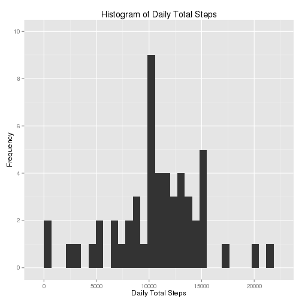
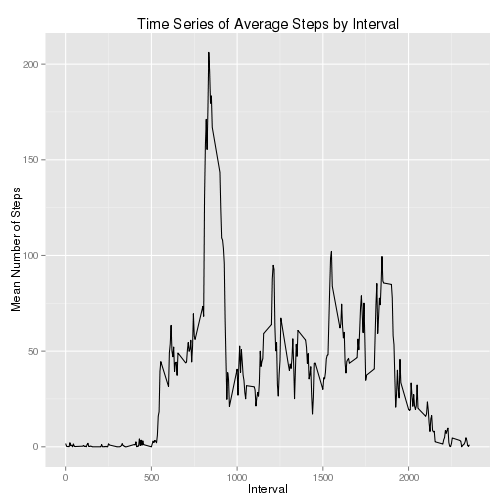
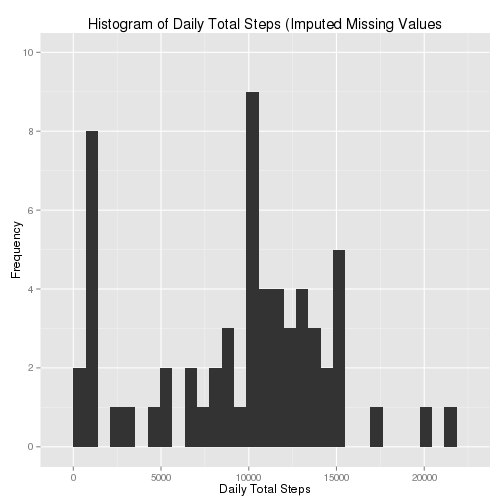
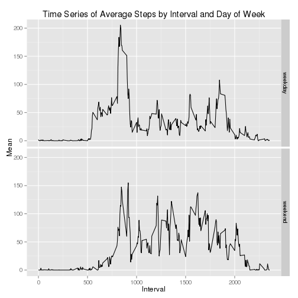

## Loading and preprocessing the data
In order to process the data more easily, I used the **dplyr** and 
**data.table** packages. I also chose to use **ggplot2** for graphing.

```r
library(dplyr)
library(ggplot2)
```
###Code for loading and preprocessing

```r
activity <- read.csv("~/Data/activity.csv")
activity$date <- as.Date(activity$date)
act_df <- tbl_df(activity)
```

## What is mean total number of steps taken per day?
First we create a data table of daily step totals.

```r
by_date <- group_by(act_df, date)
sums <- summarize(by_date,
  sum = sum(steps, na.rm = TRUE)) ##Outputs tbl_df of daily step totals
```
The next step is to remove dates with sums of zero, since these all occur as a
result of missing step counts for the entirety of those days. We can then use
this data to find our mean and median.

```r
valid_sums <- filter(sums, sum > 0)
mean(valid_sums$sum)
```

```
## [1] 10766.19
```

```r
median(valid_sums$sum)
```

```
## [1] 10765
```
Finally, we create a histogram of the daily step totals using **ggplot2**.

```r
g <- ggplot(valid_sums, aes(x = sum))
g + geom_histogram() + 
    scale_y_continuous(breaks = seq(0,10, 2), limits = c(0,10)) +
    ggtitle("Histogram of Daily Total Steps") +
    ylab("Frequency") +
    xlab("Daily Total Steps")
```

```
## stat_bin: binwidth defaulted to range/30. Use 'binwidth = x' to adjust this.
```

 

## What is the average daily activity pattern?
In order to calculate the means, we have to group by interval rather than by 
Date.

```r
by_interval <- group_by(act_df, interval)
means <- summarize(by_interval, mean = mean(steps, na.rm = TRUE))
```
We can then generate a plot, again using **ggplot2**.

```r
g <- ggplot(means, aes(x = interval, y = mean))
g + geom_line() +
  ggtitle("Time Series of Average Steps by Interval") +
  ylab("Mean Number of Steps") +
  xlab("Interval")
```

 

Finally we can identify the interval with the maximum mean number of steps: 835.

```r
arrange(means, desc(mean))[1,]
```

```
## Source: local data frame [1 x 2]
## 
##   interval     mean
## 1      835 206.1698
```
## Imputing missing values
The calculation of total number of missing values can be found easily using 
**dplyr**.

```r
act_df %>%
  filter(is.na(steps)) %>%
  summarize(n())
```

```
## Source: local data frame [1 x 1]
## 
##    n()
## 1 2304
```
Since the time series plot above demonstrates that there are patterns in the
average steps taken in each interval, it seems prudent to impute missing values 
based on interval averages rather than daily averages - especially since entire 
days are missing from the dataset. We will use the median to allow for use of 
integers. First we generate each interval's median, then add it to a new data 
frame.

```r
interval_medians <- summarize(by_interval, med = median(steps, na.rm = TRUE))
act_median_df <- inner_join(act_df, interval_medians)
```

```
## Joining by: "interval"
```

```r
##The following code replaces steps with the interval median if steps is NA.
full_df <- act_median_df %>% mutate(steps = ifelse(is.na(steps), med, steps))
```
We can then generate our histogram using the same code as we did earlier, this
time substituting `full_df` where previously we used `act_df`.


```r
by_date <- group_by(full_df, date)
sums <- summarize(by_date, sum = sum(steps))
mean(sums$sum)
```

```
## [1] 9503.869
```

```r
median(sums$sum)
```

```
## [1] 10395
```
And now for our graph:

```r
g <- ggplot(sums, aes(x = sum))
g + geom_histogram() + 
    scale_y_continuous(breaks = seq(0,10, 2), limits = c(0,10)) +
    ggtitle("Histogram of Daily Total Steps (Imputed Missing Values") +
    ylab("Frequency") +
    xlab("Daily Total Steps")
```

```
## stat_bin: binwidth defaulted to range/30. Use 'binwidth = x' to adjust this.
```

 

## Are there differences in activity patterns between weekdays and weekends?
Firstly we create the "day" column in our data frame with factor levels 
"weekday" and "weekend".

```r
days_df <- full_df %>% 
              mutate(day = weekdays(as.Date(date))) %>%
              mutate(day = ifelse((day == "Saturday" | day == "Sunday"), 
                     "weekend", "weekday")) %>%
              mutate(day = as.factor(day))
```
Then we can reuse code from above to examine and compare time series plots of 
average steps for weekend and weekdays. First we create means.

```r
means <- days_df %>%
              group_by(day, interval) %>%
              summarize(mean = mean(steps))
```
Then we plot using `day` as our facet.

```r
g <- ggplot(means, aes(x = interval, y = mean))
g + geom_line() + facet_grid(day ~ .) +
  ggtitle("Time Series of Average Steps by Interval and Day of Week") +
  ylab("Mean") +
  xlab("Interval")
```

 

There appear to be fewer average steps earlier on weekends but more throughout
the middle of the day.
